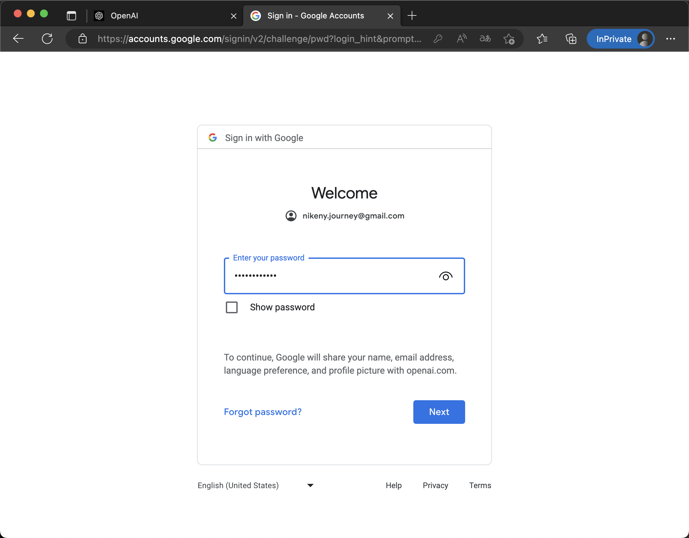

### ChatGPT注册教程

> 公众号《阿杰的人生路》
>

#### 所需材料

1.[访问外网条件（梯子、魔法）](https://www.hjtnt.pro/auth/register?code=QRY5)
2.国外手机号（淘宝、[sms接收验证码](https://sms-activate.org/?ref=4372520)）

- 推荐自己注册一个sms，以后需要验证码还可以用，比淘宝买便宜很多。首次充值多赠10%，充值1美元选择肯尼亚手机号可以注册4个ChatGPT账号。

3.Gmail邮箱 [Gmail邮箱注册教程](gmail.md)

#### 注册流程

1.首先有一个Gmail邮箱，Gmail邮箱网页注册会有问题，[Gmail邮箱注册教程](gmail.md)。

2.使用魔法，选择非亚洲地区。

3.浏览器隐身模式打开 Open AI 官网 [OpenAI](https://openai.com/)

4.打开Open AI 官网 选择 Product 下的 ChatGPT

5.进入 [ChatGPT]( https://chat.openai.com/auth/login) 页面 选择Sign up

6. 使用 Google 登录（如果这个页面打不开，就换个节点，一般都是魔法问题）

7.输入注册信息

8.获取验证码

如果提示这个，就是说你手机号不行，换手机号。

 We've detected suspicious behavior from phone numbers similar to yours. Please try again later or contact us through our help center at help.openai.com.

9.输入验证码刷新页面。

10.注册完成，一直Next，Done。这样你就可以问他问题了。

