### Gmail注册教程

> 公众号《阿杰的人生路》
>
> 回复“**gmail**”有Gmail邮箱视频注册教程。
>

#### 所需材料

> 手机APP Gmail 客户端
>

1.商店下载Gmial邮箱App。

2.在Gmail app界面上点击登录按钮-点击添加账号按钮

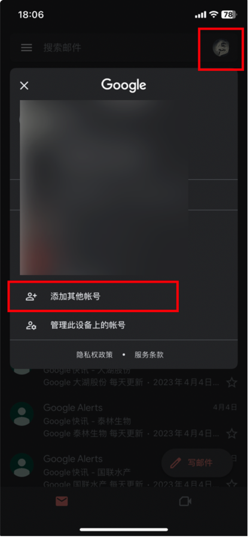

3.选择Google

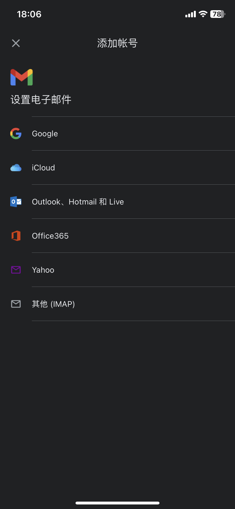

4.继续

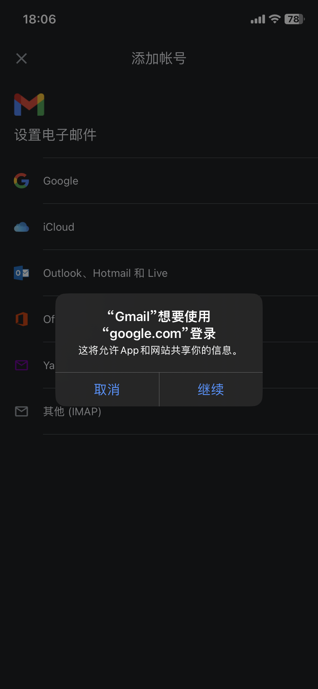

5.创建账号-为我自己创建

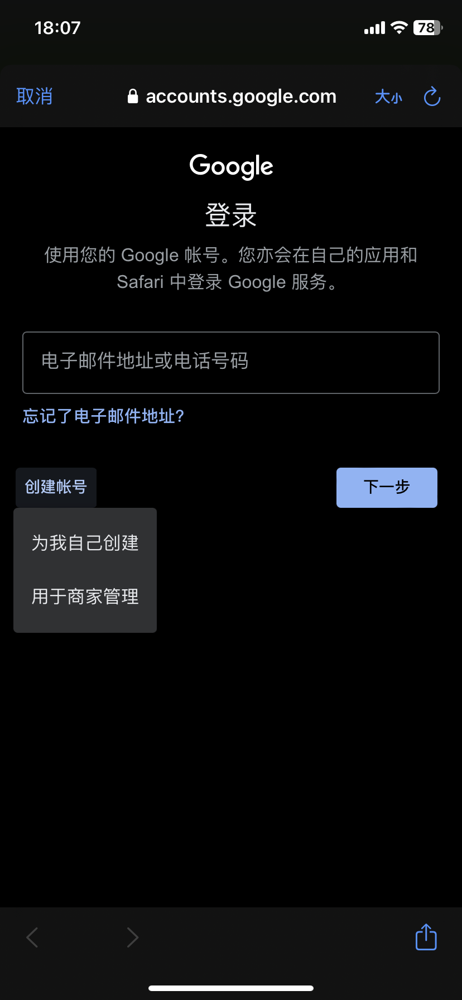

6.随便输入名字-下一步

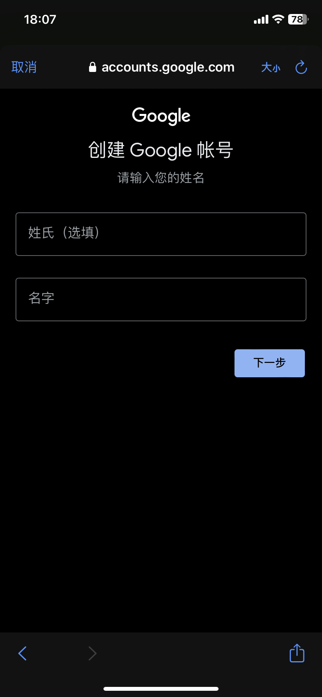

7.年月日性别最好满18-下一步

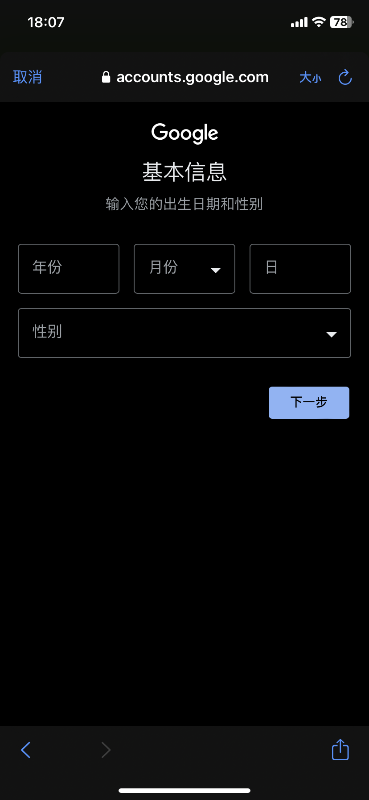

8.选择一个或者创建一个-下一步

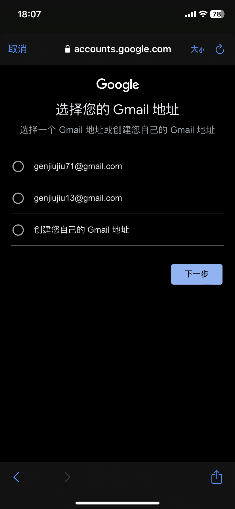

9.设置密码-下一步

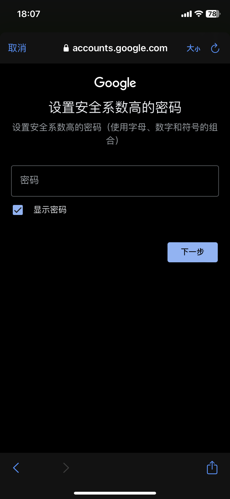

10.输入手机号-下一步

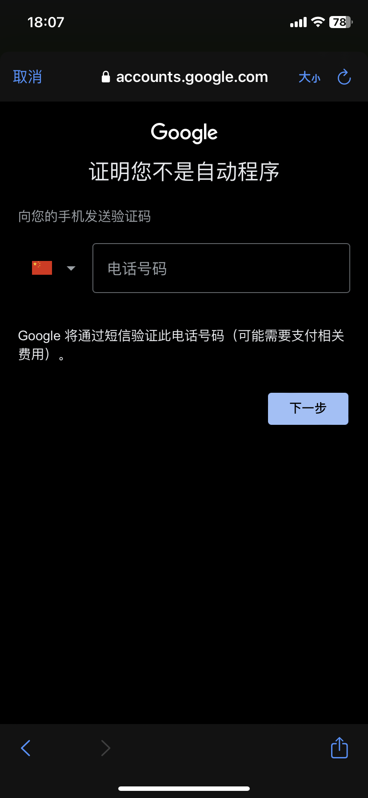

12.输入验证码-下一步

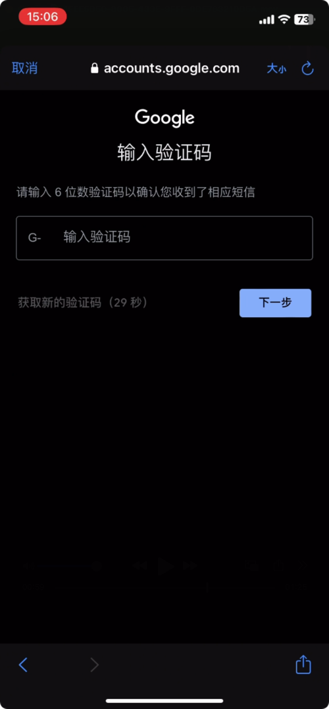

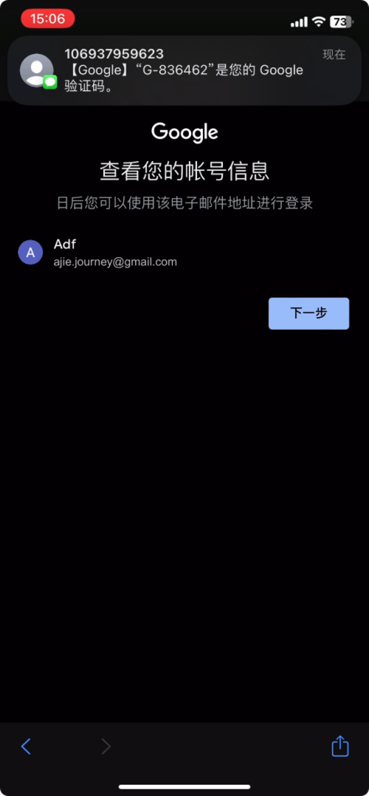

13.下滑到底部-同意

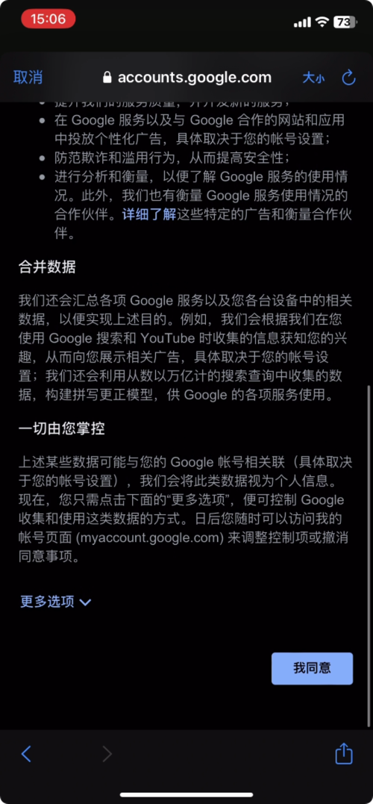

14.注册完成

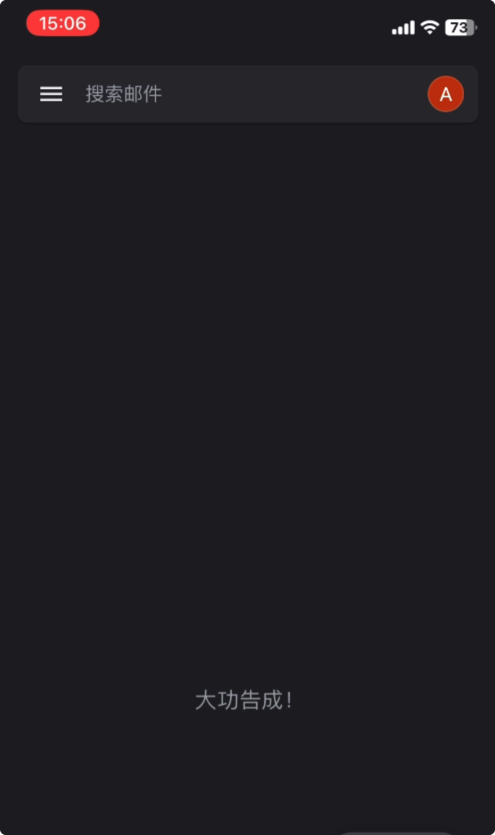
